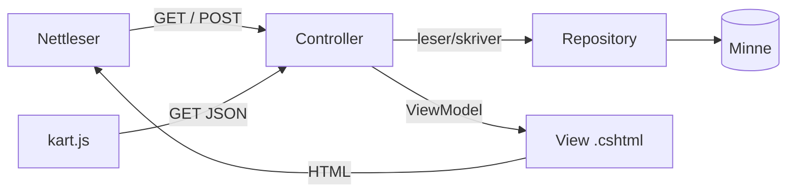

# Beredskapsportalen

En nettportal for krisesituasjoner der **offentlige aktører** (Heimevernet, kommuner) melder inn behov, og **private aktører** (bedrifter, entreprenører, privatpersoner) tilbyr ressurser som aggregater, drivstoff og transport. Behov og ressurser vises på et kart, slik at det blir lett å se hvor hjelpen trengs og hva som finnes i nærheten.

Prosjektet er laget som gruppeoppgave (Oppgave 1) og er en **ASP.NET Core MVC-applikasjon som kjøres i Docker**.

## Gruppemedlemmer

- Thilo Moi
- Tobias K. Lindkvist
- Christian Urdal Hansen
- Ludvig Jensen
- Pelle Kvandal
- Emil Lund Storebaug

---

## Hurtigstart

**Krever:** [Docker Desktop](https://www.docker.com/products/docker-desktop/)

```bash
git clone https://github.com/thilomoi05/Prosjekt_host_1.git
cd Prosjekt_host_1
docker build -t beredskapsportal .
docker run --rm -p 8080:8080 beredskapsportal
```

Åpne **http://localhost:8080** og logg inn med testbrukeren:

| Brukernavn | Passord |
|---|---|
| `test` | `test` |

Mer om kjøring, begrensninger og feilsøking: **[docs/drift.md](docs/drift.md)**

---

## Funksjoner

- **Registrering og innlogging** med rollene *Offentlig aktør* og *Privat aktør*
- **Oversikt (dashboard)** over behov og ressurser for innloggede brukere
- **Melde behov:** type, beskrivelse, prioritet (planlagt/akutt), kontaktinfo og posisjon
- **Tilby ressurser:** type, kapasitet, adresse, tilgjengelighetsperiode, kontaktinfo, posisjon og opptil 5 bilder
- **Kart** med behov og ressurser som punkter, adressesøk og posisjonsvelger i skjemaene
- **Tilgangsstyring:** ressurser (posisjon og bilder) vises bare for offentlige aktører

## Teknologi

| Område | Teknologi |
|---|---|
| Rammeverk | ASP.NET Core MVC, .NET 10 |
| Innlogging | Cookie-autentisering, PBKDF2-hashede passord |
| Kart | [Leaflet](https://leafletjs.com/) med kartfliser fra Kartverket |
| Adressesøk | Geonorge sitt adresse-API (`ws.geonorge.no/adresser/v1`) |
| Datalagring | Minnebasert (InMemory-repositories). Byttes med database senere. |
| Drift | Docker (flerstegs Dockerfile) |

---

## Arkitektur

Applikasjonen følger **MVC-mønsteret** (Model–View–Controller), med et eget **repository-lag** for datalagring. Controllerne kjenner bare repository-grensesnittene, så dagens minnebaserte lagring kan byttes med en database uten å endre dem.



Full beskrivelse av lagene, innlogging, kartet og alle endepunkter: **[docs/arkitektur.md](docs/arkitektur.md)**

### Prosjektstruktur

```
├── Controllers/        Home, Konto, Oversikt, Behov, Ressurs, Kart
├── Models/             Behov, Ressurs, Bruker, Enums
│   └── ViewModeller/   Skjemamodeller med validering
├── Services/           Repository-grensesnitt, InMemory-implementasjoner, PassordHasher
├── Views/              Én mappe per controller + Shared/_Layout
├── wwwroot/            CSS, JavaScript (kart.js, posisjonsvelger.js, kartverket.js)
├── docs/               Dokumentasjon
├── Dockerfile
└── Program.cs          Oppstart, DI, autentisering og ruting
```

### Sider og endepunkter

| Metode | Adresse | Beskrivelse | Tilgang |
|---|---|---|---|
| GET | `/` | Forside | Alle |
| GET / POST | `/Konto/Registrer` | Registrere bruker | Alle |
| GET / POST | `/Konto/LoggInn` | Logge inn | Alle |
| POST | `/Konto/LoggUt` | Logge ut | Innlogget |
| GET | `/Oversikt` | Dashboard | Innlogget |
| GET | `/Behov` | Liste over behov | Innlogget |
| GET / POST | `/Behov/Registrer` | Melde behov | Innlogget |
| GET / POST | `/Ressurs/Registrer` | Tilby ressurs med bilder | Innlogget |
| GET | `/Ressurs/Bilde/{id}` | Vise bilde av ressurs | Offentlig aktør |
| GET | `/Kart` | Kartside | Innlogget |
| GET | `/Kart/Behov` | Behov som JSON (til kartet) | Innlogget |
| GET | `/Kart/Ressurser` | Ressurser som JSON (til kartet) | Offentlig aktør |

**Flyt i et skjema (eksempel):** `GET /Behov/Registrer` viser skjemaet → brukeren sender det inn med `POST` → controlleren validerer og lagrer via repository → brukeren sendes videre til `/Behov`, der det nye behovet vises.

---

## Krav i Oppgave 1

| # | Krav | Hvor | Status |
|---|---|---|---|
| – | Kjøres i Docker | `Dockerfile`, [docs/drift.md](docs/drift.md) | Ferdig |
| 1 | Controller, view-modell og view | `Controllers/`, `Models/ViewModeller/`, `Views/` | Ferdig |
| 2 | Responsive sider med dynamisk innhold fra webserver | Razor-views, `site.css`, kartdata som JSON | Under arbeid |
| 3 | Håndterer GET og POST | Se tabellen over endepunkter | Ferdig |
| 4 | Skjema, og data vises på en annen side | Behov: `/Behov/Registrer` → `/Behov` og `/Oversikt` | Ferdig |
| 5 | Kart, og data fra kartet vises på en annen side | Posisjonsvelger i skjemaene → punkter på `/Kart` | Ferdig |
| 6 | Dokumentasjon om drift, arkitektur og testing | [docs/drift.md](docs/drift.md), arkitektur og [testing](#testing) i denne README | Under arbeid |
| 7 | Dokumentasjon i koden | Norske kommentarer og XML-summaries i koden | Ferdig |
| 8 | Bruk av KI | Se under | Ferdig |

---

## Testing

Vi har testet appen manuelt i nettleseren, med appen kjørende i Docker (se [Hurtigstart](#hurtigstart)).

**Testmiljø:** Windows, den innebygde nettleseren i VS Code, Docker Desktop · **Dato:** 30.09.2026 · **Testbruker:** `test` / `test`

✅ bestått · ⚠️ bestått med merknad

### Registrere bruker og logge inn/ut

| Scenario | Steg | Forventet resultat | Faktisk resultat |
|---|---|---|---|
| Registrere ny bruker | Gå til `/Konto/Registrer`, fyll ut alle felt og trykk «Registrer» | Brukeren logges inn og sendes til Oversikt | ✅ Logget inn og sendt til Oversikt. Navnet vises øverst til høyre |
| Logge ut | Trykk på navnet øverst til høyre | Brukeren sendes til forsiden, og menyen viser «Logg inn» | ✅ Som forventet |
| Logge inn | Logg inn med testbrukeren og med den nye brukeren | Brukeren sendes til Oversikt | ✅ Som forventet for begge brukerne |

### Feil passord og tomme felt (validering)

| Scenario | Steg | Forventet resultat | Faktisk resultat |
|---|---|---|---|
| Feil passord | Logg inn med riktig brukernavn og feil passord | Feilmelding, og brukeren blir på innloggingssiden | ✅ «Feil brukernavn eller passord.» |
| Tomt innloggingsskjema | Trykk «Logg inn» uten å fylle ut noe | Feilmelding ved hvert felt | ✅ «Du må skrive inn brukernavn.» og «Du må skrive inn passord.» |
| Tomt registreringsskjema | Trykk «Registrer» uten å fylle ut noe | Feilmelding ved hvert påkrevde felt | ✅ Feilmelding for alle fem feltene, øverst og under hvert felt |
| Ulike passord | Skriv to forskjellige passord ved registrering | Feilmelding | ✅ «Passordene er ikke like.» |
| Brukernavnet er tatt | Registrer en bruker med brukernavnet `test` | Feilmelding | ✅ «Brukernavnet er allerede i bruk.» |
| Tomt behovsskjema | Trykk «Registrer» på `/Behov/Registrer` uten å fylle ut noe | Feilmelding ved hvert påkrevde felt, også manglende posisjon | ⚠️ Alle feltene får feilmelding, men posisjonsmeldingen vises to ganger (se under) |

### Melde behov og registrere ressurs

| Scenario | Steg | Forventet resultat | Faktisk resultat |
|---|---|---|---|
| Melde behov | Fyll ut `/Behov/Registrer`, klikk i kartet og trykk «Registrer» | Brukeren sendes til `/Behov`, og det nye behovet står øverst | ✅ Behovet står øverst i listen med dagens dato |
| Registrere ressurs med posisjon | Fyll ut `/Ressurs/Registrer` med adresse, «Finn på kartet», bekreft plasseringen, legg ved bilde og trykk «Registrer» | Ressursen vises på `/Kart` på riktig sted | ✅ Grønn markør ved riktig adresse. Boblen viser adresse, tilgangsbeskrivelse, kontaktinfo og bildet |

### Docker

| Scenario | Steg | Forventet resultat | Faktisk resultat |
|---|---|---|---|
| Starte appen i Docker | Kjør kommandoene under [Hurtigstart](#hurtigstart) og åpne http://localhost:8080 | Appen starter, og forsiden vises | ✅ Appen starter, og alle testene over ble kjørt i Docker |

### Funnet under testing

| Feil | Hvor | Status |
|---|---|---|
| Meldingen «Du må klikke i kartet for å markere plasseringen.» vises to ganger øverst i skjemaet når posisjon mangler | `/Behov/Registrer`, `/Ressurs/Registrer` | Rettet: bare breddegraden sjekkes med `[Required]`, så meldingen vises én gang |

### Forbedringer vi vil gjøre

- **Adresse fra kartet:** Når brukeren klikker i kartet, skal adressen hentes ut fra koordinatene og fylles inn i adressefeltet automatisk (omvendt adressesøk). I dag går det bare motsatt vei: fra adresse til punkt på kartet.

### Ikke testet ennå

- Sider uten innlogging sender brukeren til innlogging
- Responsiv visning på mobil og desktop

---

## Bruk av KI

KI er brukt som støtte gjennom hele prosjektet. Alle endringer laget med KI har gått gjennom pull request og review fra gruppemedlemmer.

### Verktøy
- **Claude (Anthropic):** koding, feilsøking, dokumentasjon og planlegging
- [Fyll inn: andre verktøy dere har brukt]

### Bruksområder
| Fase | Hvordan KI ble brukt |
|---|---|
| Idé og design | Oversette Figma-skissen til sider og komponenter |
| Koding | Grunnstruktur (MVC, repositories, innlogging), testbruker, kartfunksjon |
| Drift | Veiledning steg for steg for Dockerfile og `.dockerignore` |
| Dokumentasjon | Utkast til `docs/drift.md` og denne README-en |
| Planlegging | Oppsett av Trello-tavle med oppgaver, arbeidsflyt og fordeling |

### Regler for KI i repoet
[AGENT.md](AGENT.md) beskriver hvordan KI-agenter skal jobbe: aldri kode direkte i `main`, alltid egen branch og pull request, og KI merger aldri sin egen PR. Commits laget med KI er merket med `Co-Authored-By: Claude`.

### Eksempler på prompter
[Fyll inn: 3–5 prompter dere faktisk har brukt, f.eks.:]
- *«Bygg forsiden etter Figma-skissen, med innlogging og skjema for behov og ressurser»*
- *«Ta meg gjennom Docker-oppsettet steg for steg og forklar hva som skjer underveis»*
- *«Se gjennom repoet og sett opp en Trello-tavle med oppgavene som er gjort og det som gjenstår»*

---

## Arbeidsflyt

- Én branch per oppgave: `feature/kort-beskrivelse` eller `fix/kort-beskrivelse`
- All kode inn via pull request, godkjent av andre gruppemedlemmer
- Branches slettes etter merge
- Oppgaver følges opp i Trello: Backlogg → Klar til start → Pågår → Til review → Ferdig

## Kjente begrensninger

- Data lagres bare i minnet og forsvinner når appen stopper. Planen er å koble på MariaDB.
- Appen kjører bare over http i Docker.
- Se [docs/drift.md](docs/drift.md) for detaljer.
