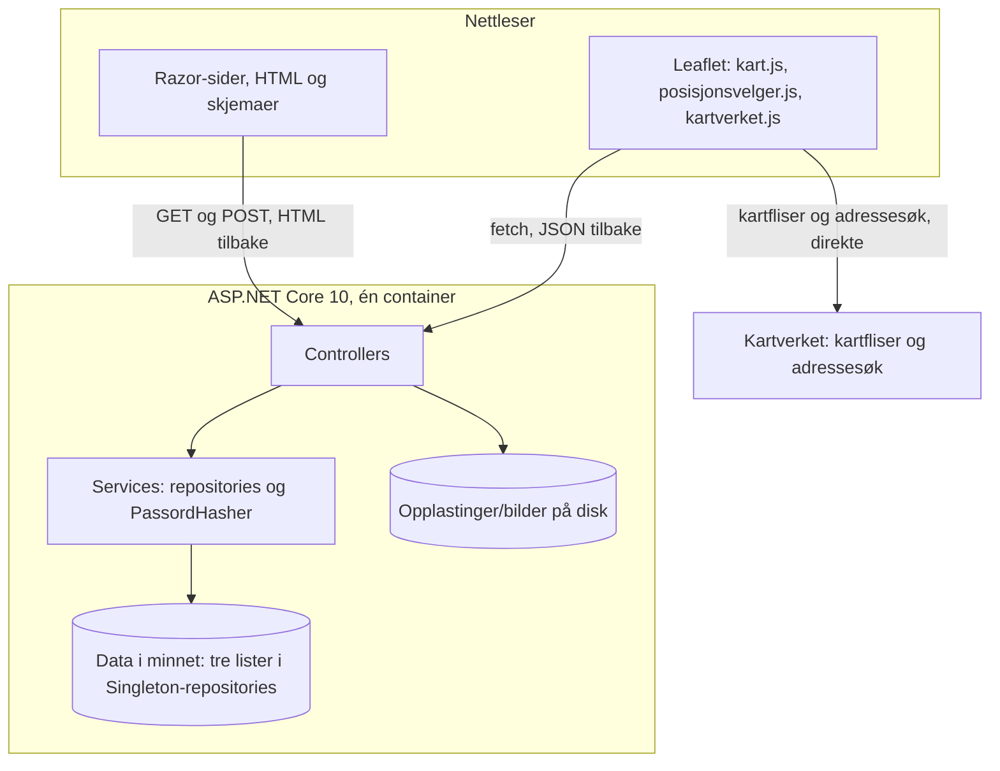
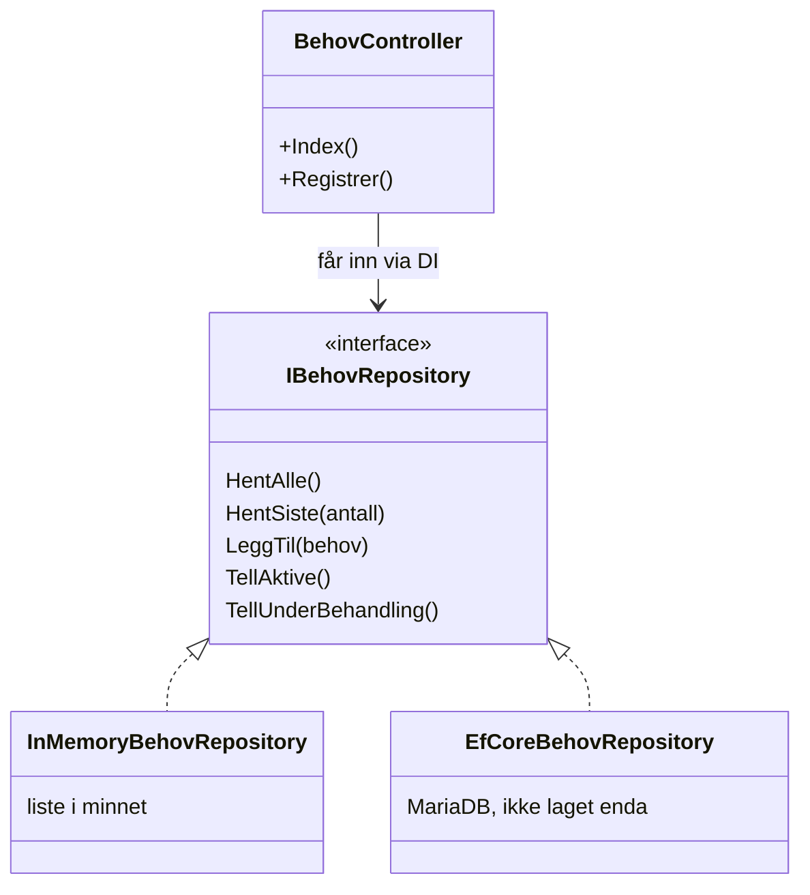
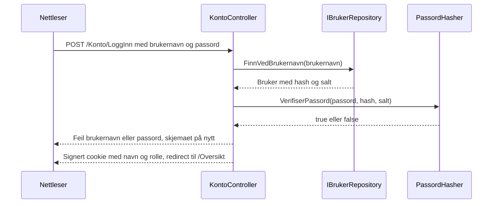
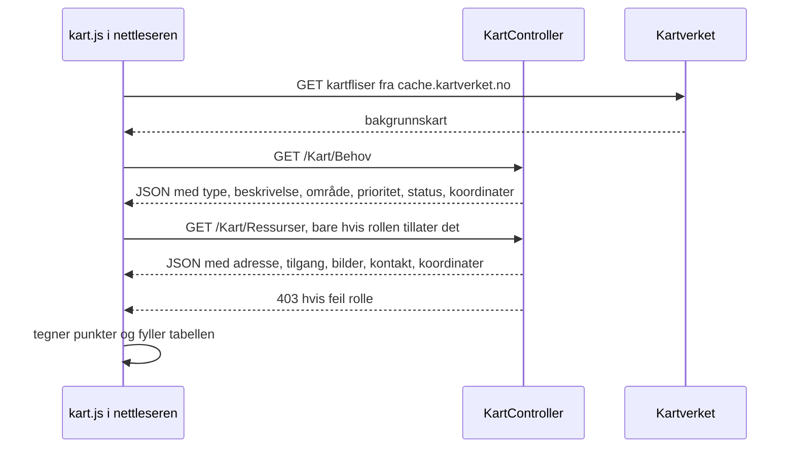
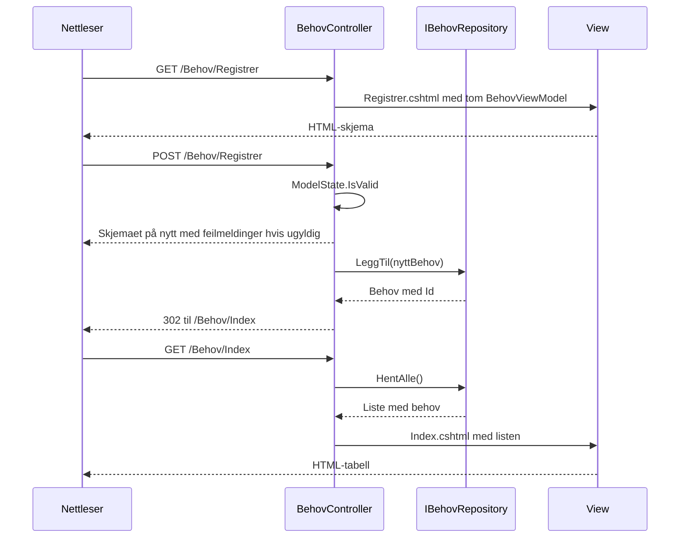
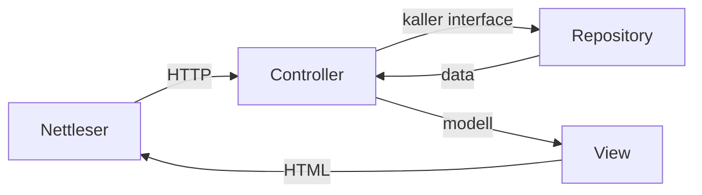

# Arkitektur

Denne siden forklarer hvordan BeredskapsPortalen er bygget opp. Den er skrevet for en som ikke kjenner prosjektet fra før. Alt som står her stemmer med koden i `main` per 26.09.2026.

Se [drift.md](drift.md) for hvordan du starter appen.

## 1. Hva portalen er

BeredskapsPortalen samler behov og ressurser under en krise, i vårt scenario et cyberangrep mot strømnettet i Kristiansand.

- **Offentlige aktører** (kommune, sykehus, brann, politi, Heimevernet) melder inn **behov**: nødstrøm, drivstoff, samband, nødbelysning, oppvarming.
- **Private aktører** (bedrifter, entreprenører, privatpersoner) registrerer **ressurser** de kan stille med: aggregat, drivstoff, UPS, transport, kommunikasjonsutstyr.
- Alt vises på et **kart** over regionen, slik at behov og ressurser kan kobles.

Rollen velges ved registrering og ligger i `BrukerRolle`: `OffentligAktor` eller `PrivatAktor`.

Hvem som ser hva:

| Data | Uinnlogget | `PrivatAktor` | `OffentligAktor` |
|---|---|---|---|
| Forside | Ja | Ja | Ja |
| Oversikt, behovsliste, kart | Nei | Ja | Ja |
| Ressurser på kartet, med adresse, tilgangsbeskrivelse og bilder | Nei | Nei | Ja |

Ressurser er skjermet fordi feltet `Tilgangsbeskrivelse` kan inneholde ting som «står i garasjen, kodelås 1234».

## 2. Overordnet bilde



To ting er verdt å merke seg. Serveren vår sender aldri kartfliser videre. Nettleseren snakker direkte med Kartverket. Og all data utenom bildene ligger i minnet, så den forsvinner når appen stoppes.

## 3. Mappestruktur

```text
Program.cs                 oppstart, DI-registrering, cookie-innlogging, rutetabell
Models/                    domenemodeller: Behov, Ressurs, Bruker, Enums
Models/ViewModeller/       skjemamodeller med validering
Controllers/               Home, Konto, Oversikt, Behov, Ressurs, Kart
Views/<Controller>/        én mappe per controller
Views/Shared/_Layout.cshtml  felles ramme: header, meny, footer
Services/                  repository-interface, InMemory-implementasjoner, PassordHasher
wwwroot/js/                kart.js, kartverket.js, posisjonsvelger.js, site.js
wwwroot/css/site.css       all egen styling
Dockerfile                 bygger og kjører appen
docs/                      drift.md, arkitektur.md
```

## 4. MVC-lagene

### Models

Domenemodellene er det systemet faktisk handler om.

| Klasse | Innhold | Merk |
|---|---|---|
| `Behov` | Type, beskrivelse, område, prioritet, status, kontakt, dato, breddegrad, lengdegrad | `VisningsNavn` gir teksten som vises, samlet ett sted |
| `Ressurs` | Type, kapasitet, adresse, tilgangsbeskrivelse, bilder, tilgjengelig fra og til, kontakt, koordinater | `Bilder` er filnavn, ikke selve filene |
| `Bruker` | Navn, e-post, brukernavn, `PassordHash`, `PassordSalt`, rolle | Passord lagres aldri i klartekst |
| `Enums` | `Prioritet`, `BehovStatus`, `BehovType`, `RessursType`, `BrukerRolle` | Status: Ny, Venter, Tildelt, Fullfort |

### ViewModeller

Skjemaene binder mot egne modeller i `Models/ViewModeller`, ikke mot domenemodellene. Grunnen er sikkerhet og validering: en bruker skal ikke kunne sende inn `PassordHash` eller `Status` ved å legge til et felt i skjemaet.

Valideringen ligger som attributter på feltene, for eksempel:

- `[Required]` med norsk feilmelding på alle obligatoriske felt
- `[Phone]` på telefon, `[EmailAddress]` på e-post
- `[Compare]` mellom passord og bekreft passord, `[MinLength(6)]` på passord
- `[Required]` på `Breddegrad` og `Lengdegrad`, som tvinger brukeren til å klikke i kartet
- `[Range(typeof(bool), "true", "true")]` på `PlasseringBekreftet` i ressursskjemaet, som krever avkryssing

Controlleren sjekker `ModelState.IsValid`. Er noe feil, returneres samme view med feilmeldingene, og brukeren beholder det de har skrevet.

### Controllers

| Controller | Tilgang | Handlinger |
|---|---|---|
| `Home` | Åpen | `Index` forside, `Error` |
| `Konto` | Åpen | `LoggInn` GET og POST, `Registrer` GET og POST, `LoggUt` POST |
| `Oversikt` | `[Authorize]` | `Index` dashbord med tre nøkkeltall og fem siste behov |
| `Behov` | `[Authorize]` | `Index` liste, `Registrer` GET og POST |
| `Ressurs` | `[Authorize]` | `Index` som sender videre til `Registrer`, `Registrer` GET og POST, `Bilde` kun for `OffentligAktor` |
| `Kart` | `[Authorize]` | `Index` kartside, `Behov` JSON, `Ressurser` JSON kun for `OffentligAktor` |

Rutene følger standardmønsteret fra `Program.cs`: `{controller=Home}/{action=Index}/{id?}`. Adressen `/Behov/Registrer` treffer altså `BehovController.Registrer`.

Alle POST-handlinger har `[ValidateAntiForgeryToken]`, som beskytter mot at andre nettsteder sender skjemaer på vegne av en innlogget bruker.

### Views

Én mappe per controller, pluss `Views/Shared/_Layout.cshtml` som holder header, meny og footer. Menyen viser forskjellige lenker avhengig av om brukeren er innlogget, og markerer den aktive siden.

`_Layout` har to valgfrie seksjoner, `Styles` og `Scripts`. Kartsidene bruker dem til å laste Leaflet bare der det trengs, i stedet for på hver eneste side.

## 5. Services og repository-mønsteret

Controllerne snakker aldri direkte med datalageret. De snakker med et interface.



`EfCoreBehovRepository` finnes ikke ennå. Den er tegnet inn for å vise poenget: når databasen kommer, lager vi nye klasser som implementerer de samme interfacene. Behov, ressurser og brukere følger alle dette mønsteret:

| Interface | Metoder | Implementasjon i dag |
|---|---|---|
| `IBehovRepository` | `HentAlle`, `HentSiste`, `LeggTil`, `TellAktive`, `TellUnderBehandling` | `InMemoryBehovRepository` |
| `IRessursRepository` | `HentAlle`, `LeggTil`, `TellTilgjengelige` | `InMemoryRessursRepository` |
| `IBrukerRepository` | `FinnVedBrukernavn`, `BrukernavnErOpptatt`, `LeggTil` | `InMemoryBrukerRepository` |

Koblingen skjer i `Program.cs`:

```csharp
builder.Services.AddSingleton<IBrukerRepository, InMemoryBrukerRepository>();
builder.Services.AddSingleton<IBehovRepository, InMemoryBehovRepository>();
builder.Services.AddSingleton<IRessursRepository, InMemoryRessursRepository>();
```

Controlleren ber om interfacet i konstruktøren, og ASP.NET Core sin DI-container leverer den registrerte implementasjonen:

```csharp
public BehovController(IBehovRepository behovRepository)
```

**Hvorfor dette er gjort slik.** Skal vi bytte til MariaDB, endrer vi tre linjer i `Program.cs`. Ingen controller, ingen view og ingen viewmodell trenger å røres. Det gjør også koden testbar: en test kan sende inn et falskt repository uten database.

To detaljer om dagens lagring:

- `AddSingleton` er brukt fordi listene lever i minnet. Med `AddScoped` ville hver forespørsel fått sin egen tomme liste.
- Repositoriene bruker `lock` rundt listene, siden flere forespørsler kan komme samtidig.
- Eksempeldata: 12 behov og 28 ressurser, pluss testbrukeren `testbruker`. `EksempelPosisjoner` gir eksempeldataene koordinater i Kristiansand, og kan slettes når ekte data kommer.

## 6. Innlogging og tilgang

Innloggingen er cookie-basert og satt opp i `Program.cs`. Passord håndteres av `PassordHasher`, som bruker PBKDF2 med SHA256, 100 000 iterasjoner, 16 byte tilfeldig salt per bruker og 32 byte hash. Sammenligningen bruker `FixedTimeEquals`, som tar like lang tid uansett hvor mye av hashen som stemmer.



Navn og rolle legges i cookien som claims. Derfor kan `_Layout` vise navnet, og `User.IsInRole` avgjøre hva som vises, uten et nytt oppslag.

Tilgangen håndheves på serveren:

- `[Authorize]` på controlleren sender uinnloggede til `/Konto/LoggInn`
- `[Authorize(Roles = "OffentligAktor")]` på `Kart.Ressurser` og `Ressurs.Bilde` gir 403 til andre
- Bildene ligger utenfor `wwwroot`, i `Opplastinger/bilder`, og sendes bare gjennom `Ressurs.Bilde`. Alt i `wwwroot` kan lastes ned av hvem som helst
- Opplastede filer får et tilfeldig `Guid`-navn, maks 5 bilder à 5 MB, og bare jpg, jpeg, png eller webp
- `Path.GetFileName` på id-en hindrer at noen ber om `../../Program.cs`

Å skjule en knapp i nettleseren er ikke tilgangskontroll. Derfor gjøres sjekken begge steder: viewet skjuler tegnforklaringen, og serveren nekter kallet.

## 7. Kartet

Tre JavaScript-filer, med hver sin oppgave:

| Fil | Oppgave |
|---|---|
| `kartverket.js` | Felles oppsett: lager Leaflet-kartet og legger på bakgrunnskart fra Kartverket. Startpunkt Kristiansand sentrum, zoom 12 |
| `kart.js` | Kartsiden: henter punkter fra serveren, tegner dem, og fyller tabellen under kartet |
| `posisjonsvelger.js` | Det lille kartet i skjemaene: brukeren klikker, koordinatene havner i to skjulte felt |



Detaljer:

- Behov tegnes som runde prikker, røde for akutt og oransje for planlagt. Ressurser tegnes som firkanter. Både farge og form brukes, slik at kartet kan leses av fargeblinde
- Tabellen under kartet viser de samme punktene. Den fungerer som alternativ for skjermlesere
- All tekst fra serveren kjøres gjennom funksjonen `trygg()` før den settes inn i HTML, så en beskrivelse med `<script>` ikke kjøres hos andre brukere
- Adressesøket i ressursskjemaet kaller Kartverkets åpne API på `ws.geonorge.no/adresser/v1/sok`, og flytter markøren til første treff. Brukeren må selv bekrefte at markøren står riktig
- `Program.cs` tvinger `InvariantCulture` på hver forespørsel, slik at koordinater med punktum (58.14) leses likt på en norsk PC og i Docker-containeren

## 8. GET- og POST-flyten

Alle skjemaene følger samme mønster: GET viser skjemaet, POST tar imot, validerer, lagrer og sender videre med en redirect. Redirect etter POST gjør at en oppfriskning av siden ikke sender skjemaet på nytt.



Hvor de ulike skjemaene sender brukeren videre:

| Skjema | Ved suksess |
|---|---|
| `POST /Konto/Registrer` | Logger inn brukeren og går til `/Oversikt` |
| `POST /Konto/LoggInn` | `/Oversikt` |
| `POST /Behov/Registrer` | `/Behov/Index` |
| `POST /Ressurs/Registrer` | `/Oversikt` |
| `POST /Konto/LoggUt` | `/` |

## 9. Kort oppsummert



Controlleren tar imot, henter eller lagrer via et repository, og gir en ferdig modell til viewet. Viewet henter aldri data selv.


To ting å være klar over utover dette:

- **Kartet henter alle punkter** i ett kall. Det går fint med 40 punkter, men ikke med 4000. Filtrering på område og status bør skje på serveren.
- **Koden følger den opprinnelige casen**, der offentlige aktører melder behov og private tilbyr ressurser. Analysedokumentet vårt avgrenset løsningen til innbygger til innbygger. Enten oppdaterer vi analysen, eller så endrer vi koden. De to bør si det samme før EXPO.
